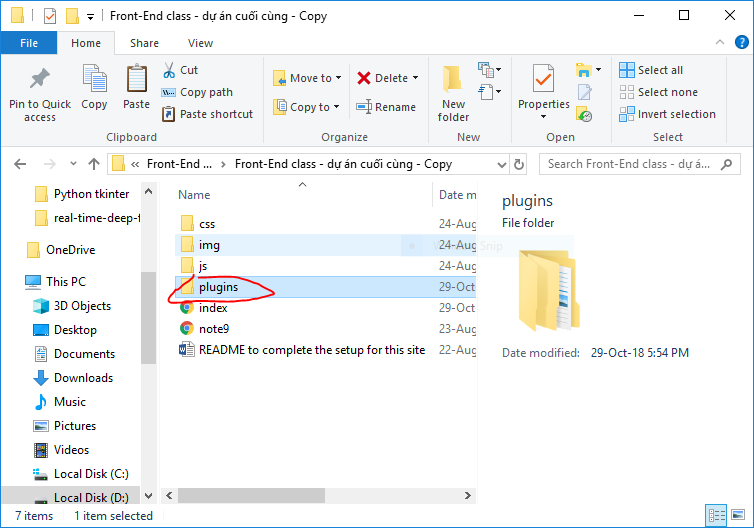

# Samsung.com-practice-project
1.Chú ý là phải tạo một folder có tên plugins cùng cấp với index.html
2.Trong folder plugins chứa folder bootstrap-4.1.0
3.Sau đó yên tâm sử dụng và chỉnh sửa.  

Có gì cứ hỏi Tuấn.
