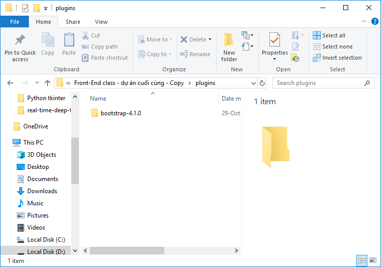

# Samsung.com-practice-project

1.Chú ý là phải tạo một folder có tên plugins cùng cấp với index.html

2.Trong folder plugins chứa folder bootstrap-4.1.0

3.Sau đó yên tâm sử dụng và chỉnh sửa. 
 

-Trong folder /plugins có folder bootstrap-4.1.0

Có gì cứ contact Tuấn.
